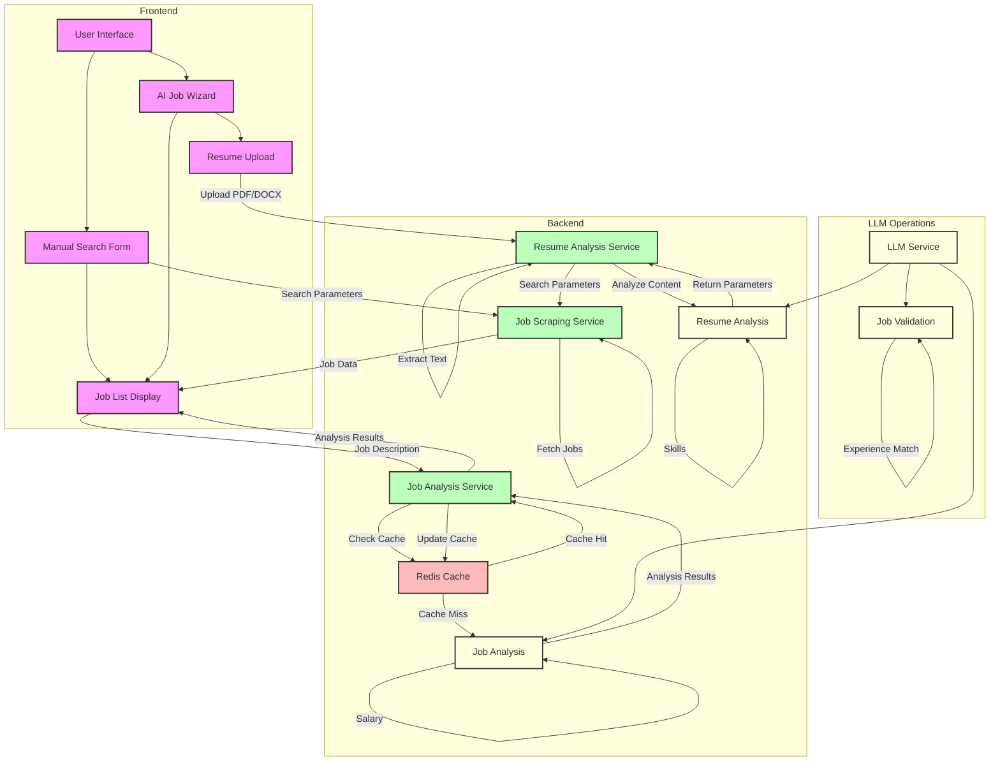

## Flow Descriptions

### Resume Analysis Flow
1. User uploads resume through AI Job Wizard
2. Resume Analysis Service extracts text from PDF/DOCX
3. LLM analyzes resume content to extract:
   - Job title/role
   - Location preferences
   - Experience years
   - Key skills
4. Extracted parameters are used for job search

### Manual Search Flow
1. User enters search parameters manually
2. Parameters are sent directly to Job Scraping Service
3. Results are displayed in Job List

### Job Scraping Flow
1. Job Scraping Service fetches jobs from multiple platforms
2. Results are filtered and cleaned
3. Jobs are sent to frontend for display

### Job Analysis Flow
1. Each job description is sent for analysis
2. Cache is checked first
3. If cache miss:
   - LLM analyzes job description
   - Results are cached
4. Analysis results update job cards in real-time

### LLM Operations
1. **Resume Analysis**
   - Extract job title/role
   - Identify location preferences
   - Calculate experience years
   - Extract key skills

2. **Job Analysis**
   - Generate job summary
   - Extract key skills
   - Determine required experience
   - Analyze company culture
   - Estimate salary range

3. **Job Validation**
   - Check requirements match
   - Verify skills compatibility
   - Validate experience level

### Caching Strategy
- Job analysis results are cached separately from validation
- Cache expiration: 7 days
- Cache structure includes:
  - Summary
  - Key skills
  - Required experience
  - Company culture
  - Estimated salary range 